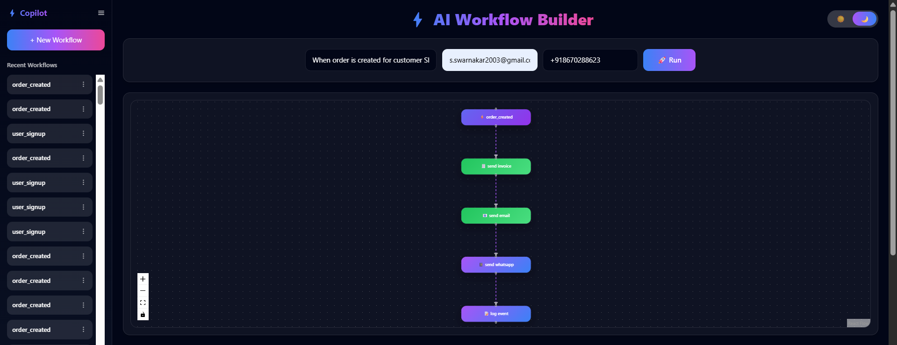
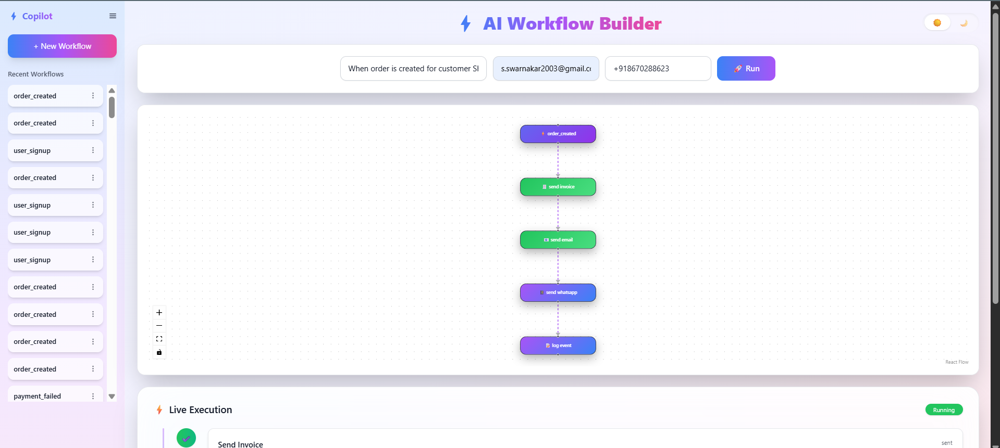
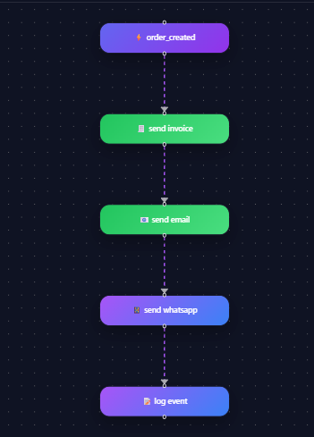
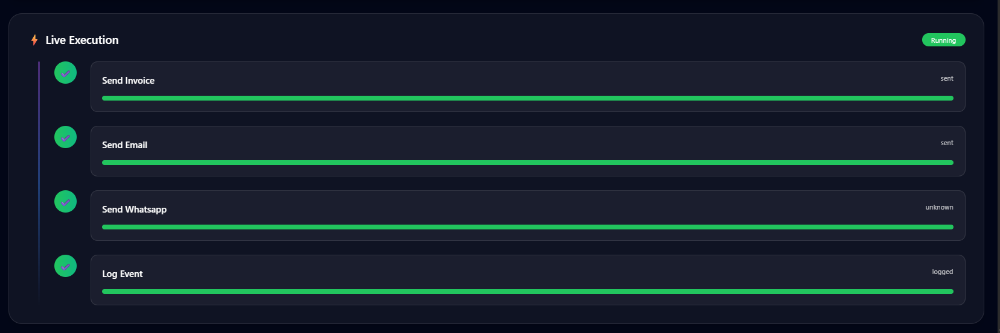
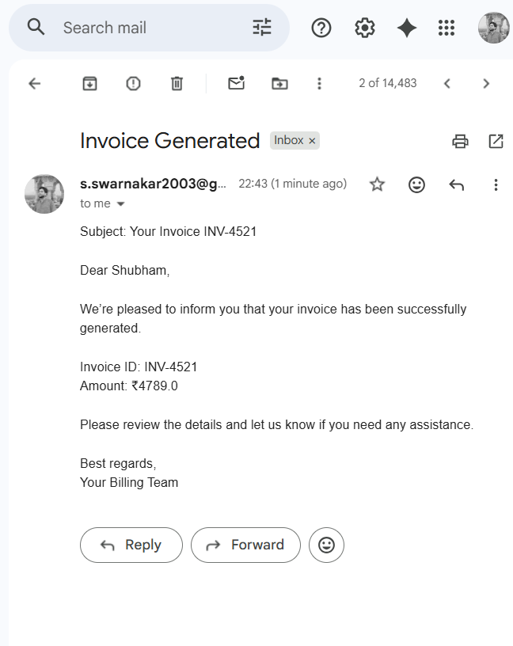
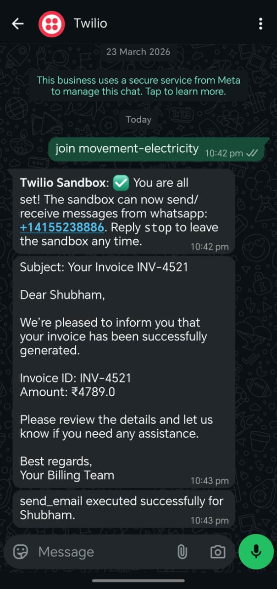
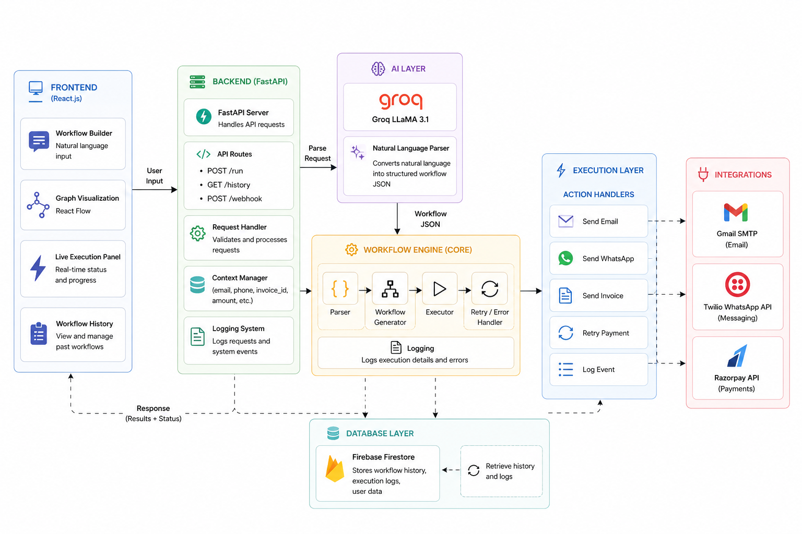

# ⚡ AI Workflow Automation Platform

> 🚀 Build, visualize, and execute real-world workflows using natural language — powered by AI.

---

## 🌍 Project Overview

Modern businesses rely heavily on workflows — sending emails, generating invoices, notifying users, retrying failed payments, and logging events.

But here’s the problem:

👉 These workflows are:

* ❌ Hardcoded
* ❌ Time-consuming to build
* ❌ Difficult to modify
* ❌ Not scalable

---

## 💡 What This Project Solves

This platform eliminates manual workflow coding by introducing an:

> 🧠 **AI-driven workflow automation engine**

Now, instead of writing code, you simply write:

```text
When order is created for customer John, send invoice and notify him
```

And the system will:

✅ Understand your intent \
✅ Convert it into structured workflow\
✅ Execute it using real APIs\
✅ Show live execution\
✅ Store history for reuse

---

## 🎯 Why This Is Powerful

This project bridges the gap between:

🧠 Human language
⚙️ Backend automation
🎨 Visual execution

It transforms **non-technical instructions → production-ready workflows**

---

## 🖼️ Product Screenshots

---

### 🚀 Main Dashboard



---

### 🌗 Light Theme UI



---

### 🎯 Workflow Visualization



---

### ⚡ Live Execution Engine



---

### 📧 Email Integration



---

### 📱 WhatsApp Integration



---

### 🏗️ System Architecture



---

## 🧠 How It Works (System Flow)

1. **User Input**

   * Natural language workflow

2. **AI Parser (Groq LLaMA 3.1)**

   * Converts text → JSON workflow

3. **Workflow Engine**

   * Executes each action step-by-step

4. **Execution Layer**

   * Email (Gmail SMTP)
   * WhatsApp (Twilio)
   * Payments (Razorpay)

5. **Database**

   * Firebase stores history

6. **Frontend**

   * Graph visualization
   * Live execution tracking

---

## 🔥 Core Features

### 🧠 AI Workflow Generation

* Natural language → structured workflow
* Intelligent trigger detection
* Action mapping via LLM

---

### 🎨 Graph Visualization

* Auto-generated workflow nodes
* Smooth animations
* Status-based colors

---

### ⚡ Live Execution Panel

* Step-by-step execution
* Real-time progress
* Timeline-based UI

---

### 🔗 Real Integrations

* 📧 Gmail SMTP
* 📱 Twilio WhatsApp
* 💳 Razorpay API
* 🗄️ Firebase Firestore

---

### 📂 Workflow History

* Auto-save workflows
* Reload previous runs
* Share workflows via link

---

### ⚙️ Sidebar Controls (3-dot menu)

* ✏️ Rename workflow
* 🗑 Delete workflow
* 🔗 Share workflow link

---

### 🧠 Smart Context Engine

* Extracts customer name
* Auto-generates invoice ID
* Handles missing data

---

### 🔁 Fault Handling

* Retry system
* Partial failure detection
* Execution logs

---

### 🌗 Modern UI

* Dark / Light mode
* Glass UI design
* Smooth animations

---

## 🧪 Example Prompts

```text
When order is created for customer Shubham, send invoice and email and whatsapp
```

```text
When payment fails, retry payment and notify admin
```

```text
When user signs up, create account and send welcome email
```

```text
When order is placed, log event and send notification
```

---

## ⚙️ Tech Stack

### Frontend

* React.js
* Tailwind CSS
* React Flow

### Backend

* FastAPI
* Python

### AI

* Groq LLaMA 3.1

### Integrations

* Gmail SMTP
* Twilio WhatsApp
* Razorpay

### Database

* Firebase Firestore

---

## 🚀 Setup Guide

### 🔹 Clone Repo

```bash
git clone https://github.com/your-username/AI-Workflow-Automation.git
cd AI-Workflow-Automation
```

---

### 🔹 Backend Setup

```bash
cd backend

python -m venv venv
venv\Scripts\activate

pip install -r requirements.txt
uvicorn app.main:app --reload
```

---

### 🔹 Frontend Setup

```bash
cd frontend

npm install
npm run dev
```

---

## 🔐 Environment Variables

Create `.env`:

```env
GROQ_API_KEY=your_key

MAIL_USERNAME=your_email
MAIL_PASSWORD=your_password

TWILIO_SID=your_sid
TWILIO_AUTH_TOKEN=your_token

RAZORPAY_KEY_ID=your_key
RAZORPAY_KEY_SECRET=your_secret
```

---

## 📈 Future Scope

* Drag & Drop Builder
* Multi-agent workflows
* Workflow templates
* Analytics dashboard
* Cloud deployment

---

## 📜 License

MIT License © 2026 Shubham Swarnakar

---

## ⭐ Support

If you like this project:

⭐ Star it
🔗 Share it
🚀 Build on top of it

---
